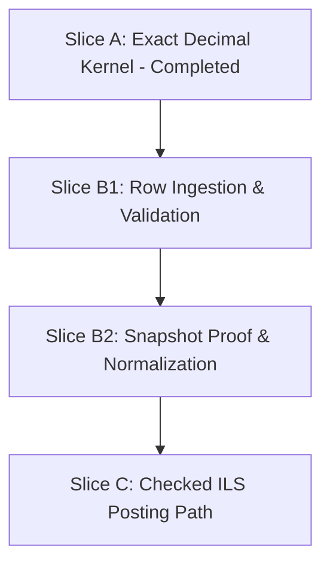

# Currency Stage 2 Slice B Split Decision

Status: completed
Owner: config
Canonical: yes
Decision date: 2026-07-10
Exit: archived or superseded when Currency Stage 2 Slice B runtime implementation is fully complete or superseded by a later implementation plan

## Purpose

Decide how the remaining selected Currency Stage 2 Slice B semantics should be divided into the smallest executable runtime sub-slices with explicit ownership, boundaries, prerequisites, and exit evidence, to ensure safety, ease of verification, and adherence to the Quality Bar.

## Reviewed Current Owners

*   [exact_decimal.bqn](file:///Users/user/Projects/moko/bqn-ledger/src_next/exact_decimal.bqn) - Pure exact-decimal source parser module (Slice A kernel).
*   [context.bqn](file:///Users/user/Projects/moko/bqn-ledger/src_next/context.bqn) - Ingestion orchestration, proof resolution, and projection coordination.
*   [projection.bqn](file:///Users/user/Projects/moko/bqn-ledger/src_next/projection.bqn) - Proof authorization and posting row projection.

## Preserved Semantics

This decision preserves the semantics already selected by [CURRENCY_STAGE2_EXPLICIT_SINGLE_CURRENCY_EXACT_DECIMAL_IMPLEMENTATION_PLAN.md](file:///Users/user/Projects/moko/bqn-ledger/docs/CURRENCY_STAGE2_EXPLICIT_SINGLE_CURRENCY_EXACT_DECIMAL_IMPLEMENTATION_PLAN.md):
*   **Exact decimal representation**: `{coefficient, scale, source_text, state, message}`.
*   **Parser grammar**: `digits+` or `digits+ "." digits+`.
*   **Snapshot-wide scale (`amount_scale`)**: Maximum canonical scale of all admitted rows.
*   **Coefficient normalization**: `normalized_coefficient = coefficient × 10^(amount_scale - row.scale)`.
*   **Fail-closed invariants**: Fails closed on any invalid decimal syntax, duplicated metadata, or coefficient overflow (parsed or normalized).
*   **One shared-snapshot invariant**: Load, parse, resolve, normalize, prove, and project must happen on the same in-memory snapshot.

## Selected Split

We divide the remaining work into three sequential, independently finite executable sub-slices:



### Slice B1: Row Currency and Exact Decimal Ingestion

*   **Description**: Replaces the simple integer-only amount check in `context.bqn` with `exact_decimal.Parse` for all rows. Resolves row currency metadata from fields after the first five. Parses amounts to `{coefficient, scale}` and checks row-level exact coefficient conversion. Attaches resolved currency and exact-decimal information to each row as raw evidence.
*   **Prerequisites**: Slice A (completed).
*   **Ownership**: `src_next/context.bqn` (row ingestion / `MakeProjectionRowRaw`).
*   **Inputs**: Raw posting source lines (`journalLines`, `planLines`, `budgetLines`).
*   **Outputs**: Projection rows augmented with:
    *   `row.resolved_currency` (string)
    *   `row.parsed_amount` (exact-decimal result structure)
*   **What Remains Absent**: No snapshot-wide domain aggregation (no checking of multi-domain compatibility at the snapshot level yet), no `amount_scale` selection, no coefficient normalization, no proof carrier extension, and no ILS projection admission.
*   **Exit Evidence**:
    *   Valid legacy JPY integers (e.g. `1200`) parse to scale 0 and resolve to JPY.
    - Valid explicit JPY amounts (e.g. `12.00 currency=JPY`) parse to scale 2 and resolve to JPY.
    *   Valid explicit ILS amounts (e.g. `42.50 currency=ILS`) parse to scale 1 and resolve to ILS in internal row evidence.
    *   Snapshot loading still fails closed on ILS rows at context/proof level because the proof resolver remains JPY-only.
    *   Unit tests in `tests/test_src_next_context.bqn` verify that row currency resolution and amount parsing correctly fail closed on duplicate `currency=` tokens or invalid syntax (e.g. `currency=USD`) at the row level.

### Slice B2: Snapshot Domain Aggregation and Arithmetic Proof

*   **Description**: Aggregates row evidence across the loaded snapshot. Requires exactly one resolved domain across all rows (fails closed on mixed domains). Selects `amount_scale` (maximum canonical row scale). Normalizes coefficients to `amount_scale`, checking that normalized values remain within exact integer range (fails closed on overflow). Extends `arithmetic_currency_proof` carrier. Updates projected `delta` to use the signed normalized coefficient.
*   **Prerequisites**: Slice B1.
*   **Ownership**: `src_next/context.bqn` (proof resolution, normalization loop).
*   **Inputs**: Row evidence from Slice B1.
*   **Outputs**:
    *   Posting row `delta` updated to normalized signed integer coefficients.
    *   Extended `arithmetic_currency_proof` carrier: `{state, domain, basis, amount_scale, message}`.
    *   Proof basis `resolved_single_currency` supported.
*   **What Remains Absent**: Still no ILS projection admission. Projection authorizer still rejects non-JPY domains.
*   **Exit Evidence**:
    *   Fixture with mixed JPY/ILS rows fails closed.
    *   Fixture with normalized coefficient range overflow fails closed.
    *   Legacy JPY works as before (under basis `legacy_compatibility` or `resolved_single_currency` with scale 0).
    *   ILS proof resolves successfully with correct `amount_scale` and basis `resolved_single_currency`, but projection fails closed with an authorization error.
    *   Unit tests verify exactness checks and proof results.

### Slice C: Checked ILS Posting Path

*   **Description**: Permits the projection to authorize proven `ILS` domain proofs. Downstream cube and TBDS receive the normalized signed integer deltas under the same-snapshot invariant.
*   **Prerequisites**: Slice B2.
*   **Ownership**: `src_next/projection.bqn` (proof authorizer logic).
*   **Inputs**: Snapshot proof and normalized rows.
*   **Outputs**: Admitted ILS projection rows in cube/TBDS.
*   **Exit Evidence**:
    *   All-ILS fixture loads and runs successfully through context, cube, and TBDS, showing correct balances.
    *   Mixed JPY/ILS still fails closed.
    *   JPY continues to work exactly as before.

---

## Responsibility Table

| Feature / Invariant | Introduced in Slice | Owner | Input | Output / Evidence |
|---|---|---|---|---|
| Row currency resolution | **Slice B1** | `context.bqn` | Raw metadata fields | `row.resolved_currency` |
| Row exact decimal parsing | **Slice B1** | `context.bqn` | Raw amount text | `row.parsed_amount` |
| Row-level exact range check | **Slice B1** | `context.bqn` | Parsed coefficient | Fail closed if out of range |
| Single domain constraint | **Slice B2** | `context.bqn` | All `row.resolved_currency` | Fail closed if mixed domains |
| Snapshot-wide `amount_scale` | **Slice B2** | `context.bqn` | All `row.parsed_amount.scale` | `proof.amount_scale` |
| Coefficient normalization | **Slice B2** | `context.bqn` | Parsed row coefficients | `row.delta` (normalized) |
| Normalized range check | **Slice B2** | `context.bqn` | Normalized coefficients | Fail closed if out of range |
| Extended proof carrier | **Slice B2** | `context.bqn` | In-memory aggregation | `arithmetic_currency_proof` |
| ILS projection admission | **Slice C** | `projection.bqn` | Admitted proof & rows | Admitted ILS posting rows |

---

## Snapshot Invariant Preservation

The one-shared-snapshot invariant is preserved across the split as follows:
1.  **Ingestion**: `LoadPostingSourceSnapshot` is called once, loading `journal.tsv`, `plan.tsv`, and `budget_alloc.tsv` into memory.
2.  **Row Resolution (B1)**: All rows in the snapshot are parsed and validated in place. Row metadata and exact decimal properties are attached directly to the row records.
3.  **Proof Generation & Normalization (B2)**: The snapshot proof resolver reads the resolved currencies and scales from the in-memory row records, aggregates them, and updates the row records' `delta` values with normalized coefficients.
4.  **Authorization (C)**: The projection receives the normalized rows and the proof directly from the same context structure without re-reading the source TSV files.

---

## Rejected Alternatives

*   **Alternative 1: Original single Slice B bundle**
    *   *Why rejected*: Combined too many changes. Row metadata parsing, amount parsing, domain aggregation, scale selection, normalization, and proof extension would be implemented all at once. This makes the PR extremely large and violates the Quality Bar requirement of small, reversible changes.
*   **Alternative 2: Separating B1 into B1a (amount parsing only) and B1b (currency resolution only)**
    *   *Why rejected*: Over-fragmentation. Amount parsing and currency resolution are both row-level parsing operations that occur during raw row ingestion. Implementing them together in B1 is highly coherent because they are both stateless operations performed on the same row metadata fields and amount fields. Separating them would require introducing temporary row schemas that have parsed amounts but no currency metadata, or vice versa, creating unnecessary intermediate code churn.
*   **Alternative 3: Separating B2 into B2a (domain proof and scale selection) and B2b (coefficient normalization)**
    *   *Why rejected*: Mathematically inconsistent. Selecting a snapshot-wide `amount_scale` without normalizing the coefficients to that scale would leave the projection in an incorrect state where deltas of different scales are aggregated, causing silent arithmetic errors or requiring temporary dummy normalization. The scale selection and normalization are structurally co-dependent and must be introduced together to remain correct.

---

## Next Runtime Slice Only

The next authorized runtime slice is:

```text
Currency Stage 2 Slice B1: Row Currency and Exact Decimal Ingestion
```

No later slices are authorized for execution until Slice B1 is successfully implemented, verified, and merged.
