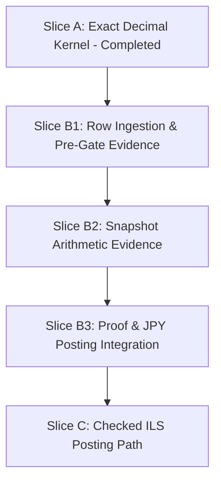

# Currency Stage 2 Slice B Split Decision

Status: active plan
Owner: config
Canonical: yes
Decision date: 2026-07-10
Exit: archive or supersede after the selected staged runtime path reaches checked ILS posting path (Slice C completion) or a later decision replaces this split

## Purpose

Decide how the remaining selected Currency Stage 2 Slice B semantics should be divided into the smallest executable runtime sub-slices with explicit ownership, boundaries, prerequisites, and exit evidence, to ensure safety, ease of verification, and adherence to the Quality Bar.

## Reviewed Current Owners

*   [exact_decimal.bqn](../src_next/exact_decimal.bqn) - Pure exact-decimal source parser module (Slice A kernel).
*   [context.bqn](../src_next/context.bqn) - Ingestion orchestration, proof resolution, and projection coordination.
*   [projection.bqn](../src_next/projection.bqn) - Proof authorization and posting row projection.

## Preserved Semantics

This decision preserves the semantics already selected by [CURRENCY_STAGE2_EXPLICIT_SINGLE_CURRENCY_EXACT_DECIMAL_IMPLEMENTATION_PLAN.md](CURRENCY_STAGE2_EXPLICIT_SINGLE_CURRENCY_EXACT_DECIMAL_IMPLEMENTATION_PLAN.md):
*   **Exact decimal representation**: `{coefficient, scale, source_text, state, message}`.
    *   *Example*: `12.00` yields `coefficient = 12`, `scale = 0`, and `source_text = "12.00"`. Trailing fractional zeros are removed for arithmetic canonicalization.
    *   *Example*: `12.34` yields `coefficient = 1234`, `scale = 2`, and `source_text = "12.34"`.
    *   *Preserve*: Canonical arithmetic scale (`scale`) is distinct from the raw source spelling or display precision.
*   **Parser grammar**: `digits+` or `digits+ "." digits+`.
*   **Snapshot-wide scale (`amount_scale`)**: Maximum canonical scale of all admitted rows.
*   **Coefficient normalization**: `normalized_coefficient = coefficient × 10^(amount_scale - row.scale)`.
*   **Fail-closed invariants**: Fails closed on any invalid decimal syntax, duplicated metadata, or coefficient overflow (parsed or normalized).
*   **One shared-snapshot invariant**: Load, parse, resolve, normalize, prove, and project must happen on the same in-memory snapshot.

---

## Selected Split

Execution status at 2026-07-10:

- B1 merged in PR #146 and is post-implementation verified by [`CURRENCY_STAGE2_SLICE_B1_POST_IMPLEMENTATION_VERIFICATION-2026-07-10.md`](archive/audits/CURRENCY_STAGE2_SLICE_B1_POST_IMPLEMENTATION_VERIFICATION-2026-07-10.md).
- B2 is the next authorized finite runtime slice; B3 and C remain unauthorized until their prerequisites are implemented and verified.

We divide the remaining work into four sequential, independently finite executable sub-slices:



### Slice B1: Row Ingestion and Pre-Gate Row Evidence

*   **Description**: Replaces the simple integer-only amount check in `context.bqn` row ingestion with a pre-gate row evidence stage that consumes the in-memory snapshot exactly once. Resolves row currency metadata and parses row amounts using `exact_decimal.Parse`.
*   **Prerequisites**: Slice A (completed).
*   **Ownership**: `src_next/context.bqn` (ingestion orchestration).
*   **Execution Flow**:
    1.  `LoadPostingSourceSnapshot` once.
    2.  `BuildRowEvidenceFromSnapshot`:
        *   Splits admitted rows into fields.
        *   Resolves currency metadata (no tag → JPY, currency=JPY → JPY, currency=ILS → ILS, others/duplicates → fail closed).
        *   Invokes `exact_decimal.Parse` to parse the amount text.
        *   Fails closed immediately on any row-level syntax error, duplicate metadata token, unsupported currency, or out-of-range parsed coefficient.
        *   Returns a list of structured row evidence records carrying resolved currency and parsed exact-decimal fields.
    3.  `ResolveArithmeticCurrencyProof` consumes this pre-built row evidence list (rather than re-splitting the snapshot lines).
*   **Boundary Constraints**:
    *   **B1 row evidence != projection posting rows**: The evidence is internal and does not replace or modify the final projection posting rows.
    *   **B1 must not admit explicit currency rows or implicit JPY decimal rows (canonical scale > 0) through the proof gate**: Since the proof carrier is not extended and the basis `resolved_single_currency` is not introduced until Slice B3, `ResolveArithmeticCurrencyProof` must continue to accept only legacy JPY snapshots (where all rows lack explicit currency metadata, mapping to `legacy_compatibility`) or empty snapshots (`empty_source_compatibility`) AND every participating row has parsed canonical amount scale = 0. If any row contains explicit currency metadata (e.g. `currency=JPY` or `currency=ILS`) or has parsed canonical amount scale > 0 (e.g. `12.34` without `currency=`), the proof gate must fail closed. `legacy_compatibility` must not be reused for explicit currency rows or implicit decimal JPY rows, as normalization is not integrated yet.
    *   `delta` in final projection posting rows remains the parsed JPY integer (with scale 0).
*   **Exit Evidence**:
    *   Valid legacy JPY integers (e.g. `1200`) parse to scale 0 and resolve to JPY.
    *   Valid explicit JPY decimals (e.g. `12.34 currency=JPY`) parse to scale 2 and resolve to JPY in internal row evidence.
    *   Valid explicit ILS decimals (e.g. `42.50 currency=ILS`) parse to scale 1 and resolve to ILS in internal row evidence.
    *   Context load fails closed on any snapshot containing explicit JPY rows (e.g. `currency=JPY`), explicit ILS rows (e.g. `currency=ILS`), implicit JPY decimal rows with canonical scale > 0 (e.g. `12.34` without `currency=`), or mixed rows, because the proof resolver remains strictly JPY-legacy-only and accepts only `legacy_compatibility` or `empty_source_compatibility` bases.
    *   Unit tests in `tests/test_src_next_context.bqn` verify that row currency resolution and amount parsing correctly fail closed on duplicate `currency=` tokens or invalid syntax (e.g. `currency=USD`) at the row level.

### Slice B2: Snapshot Arithmetic Evidence

*   **Description**: Implements the snapshot-wide arithmetic verification logic in a pure helper function. Aggregates row evidence, selects the snapshot-wide `amount_scale`, and normalizes coefficients.
*   **Prerequisites**: Slice B1.
*   **Ownership**: `src_next/currency_arithmetic.bqn` (dedicated pure snapshot arithmetic owner), orchestrated by `src_next/context.bqn`. The completed ownership recheck is [`CURRENCY_STAGE2_B2_ARITHMETIC_OWNERSHIP_RECHECK-2026-07-11.md`](archive/completed-plans/CURRENCY_STAGE2_B2_ARITHMETIC_OWNERSHIP_RECHECK-2026-07-11.md).
*   **Execution Flow**:
    *   Aggregates the row evidence records from Slice B1.
    *   Requires exactly one resolved domain across all rows (fails closed on mixed domains, e.g. JPY + ILS).
    *   Selects `amount_scale` (maximum canonical row scale).
    *   Exact-normalizes coefficients to `amount_scale`.
    *   Fails closed if any normalized coefficient overflows the exact integer range.
    *   Returns an internal arithmetic evidence structure.
*   **Boundary Constraints**:
    *   No proof carrier extension.
    *   No projection row `delta` changes (projection still uses JPY integers).
    *   No ILS projection admission.
    *   **B2 must keep full projection admission for scale > 0 rows closed**: Although B2 computes and tests scale > 0 arithmetic evidence internally, full projection admission for scale > 0 rows remains closed because the projection posting row deltas are not normalized and proof carrier is not extended. The existence of correct B2 arithmetic evidence must not silently change projection behavior.
*   **Exit Evidence**:
    *   Focused unit tests import `src_next/currency_arithmetic.bqn` directly and verify that:
        *   Mixed JPY/ILS row evidence fails closed.
        *   Normalized coefficient range overflow fails closed.
        *   Single-currency row evidence aggregates correctly and returns correct `amount_scale` and normalized coefficients (verified for both JPY and ILS inputs).

### Slice B3: Proof and JPY-only Posting Integration

*   **Description**: Integrates the snapshot arithmetic evidence into the main context proof carrier and projection posting rows. B3 is the first slice that integrates the selected proof basis and normalization into the main projection path. Therefore, B3 is the earliest slice where scale > 0 JPY rows (both explicit JPY and implicit JPY decimals) may be considered for full checked posting admission.
*   **Prerequisites**: Slice B2.
*   **Ownership**: `src_next/context.bqn` (context building orchestration) and `src_next/projection.bqn` (proof authorization JPY-only constraint).
*   **Execution Flow**:
    *   Extends `arithmetic_currency_proof` carrier to carry `amount_scale`: `{state, domain, basis, amount_scale, message}`.
    *   Supports `resolved_single_currency` proof basis.
    *   Updates the final projection row building so that `delta` uses the signed normalized coefficient.
*   **Boundary Constraints**:
    *   Projection authorization in `projection.bqn` remains JPY-only (ILS remains closed). Only JPY proof domains (both legacy and resolved single currency) are admitted.
*   **Exit Evidence**:
    *   legacy integer-only JPY regression:
        *   amount_scale = 0
        *   normalized coefficient equals existing integer amount
        *   posting delta unchanged
        *   golden behavior unchanged
    *   explicit or implicit decimal JPY:
        *   amount_scale equals maximum canonical row scale
        *   normalized coefficients are exact
        *   signed posting deltas use normalized coefficients
        *   aggregate totals remain exact
    *   Any ILS proof resolves successfully with correct `amount_scale`, but context loading fails closed because the projection authorizer rejects ILS.
    *   Fixture tests confirm JPY normalized postings.

### Slice C: Checked ILS Posting Path

*   **Description**: Opens the projection authorization gate to permit proven `ILS` domain proofs. Downstream cube and TBDS receive the normalized signed integer deltas under the same-snapshot invariant.
*   **Prerequisites**: Slice B3.
*   **Ownership**: `src_next/projection.bqn` (proof authorizer logic).
*   **Inputs**: Snapshot proof and normalized rows.
*   **Outputs**: Admitted ILS projection rows in cube/TBDS.
*   **Exit Evidence**:
    *   All-ILS fixture loads and runs successfully through context, cube, and TBDS, showing correct balances.
    *   Mixed JPY/ILS still fails closed.
    *   JPY continues to work exactly as before.

---

## Responsibility Table

| Feature / Invariant | Introduced in Slice | Owner | Input | Output / Evidence |
|---|---|---|---|---|
| Row currency resolution | **Slice B1** | `context.bqn` | Raw metadata fields | Row evidence resolved currency |
| Row exact decimal parsing | **Slice B1** | `exact_decimal.bqn` (parsing) / `context.bqn` (orchestration) | Raw amount text | Row evidence parsed amount |
| Row-level exact range check | **Slice B1** | `exact_decimal.bqn` (diagnostic) / `context.bqn` (orchestration) | Parsed coefficient | Fail closed on parsed overflow |
| Single domain constraint | **Slice B2** | `currency_arithmetic.bqn` | Pre-built B1 row evidence currencies | Fail closed if mixed domains |
| Snapshot-wide `amount_scale` | **Slice B2** | `currency_arithmetic.bqn` | Pre-built B1 row evidence scales | Snapshot arithmetic scale |
| Coefficient normalization | **Slice B2** | `currency_arithmetic.bqn` | Pre-built B1 row evidence coefficients | Normalized coefficients |
| Normalized range check | **Slice B2** | `currency_arithmetic.bqn` | Normalized coefficients | Fail closed on normalized overflow |
| Extended proof carrier | **Slice B3** | `context.bqn` | Arithmetic evidence | `arithmetic_currency_proof` |
| Normalized posting deltas | **Slice B3** | `context.bqn` | Normalized coefficients | Projection posting row `delta` |
| ILS projection admission | **Slice C** | `projection.bqn` | Admitted proof & rows | Admitted ILS posting rows |

---

## Snapshot Invariant Preservation

The one-shared-snapshot invariant is preserved across the split as follows:
1.  **Ingestion**: `LoadPostingSourceSnapshot` is called once, loading `journal.tsv`, `plan.tsv`, and `budget_alloc.tsv` into memory.
2.  **Row Evidence (B1)**: All rows in the snapshot are parsed and validated in place by `BuildRowEvidenceFromSnapshot`. No files are re-read.
3.  **Arithmetic & Proof Generation (B2/B3)**: `context.bqn` passes the in-memory B1 row evidence directly to pure `currency_arithmetic.bqn`; the arithmetic owner does not read files or rebuild evidence. `context.bqn` later consumes that evidence for final proof generation.
4.  **Authorization (B3/C)**:
    *   **B3**: The proof and normalized rows come from the same in-memory evidence, but projection authorization remains JPY-only.
    *   **C**: Later widen authorization to proven ILS without source re-read, preserving the same-snapshot invariant.

---

## Exact-Decimal Ownership Preservation

The pure exact-decimal grammar, canonicalization, and coefficient exactness diagnostics are owned exclusively by `src_next/exact_decimal.bqn`. `src_next/context.bqn` orchestrates and consumes `exact_decimal.Parse` as a black box and does not reimplement parser or exact-range validation logic.

---

## Rejected Alternatives

*   **Alternative 1: Original single Slice B bundle**
    *   *Why rejected*: Combined too many changes. Row metadata parsing, amount parsing, domain aggregation, scale selection, normalization, and proof extension would be implemented all at once. This makes the PR extremely large and violates the Quality Bar requirement of small, reversible changes.
*   **Alternative 2: Separating B1 into B1a (amount parsing only) and B1b (currency resolution only)**
    *   *Why rejected*: Over-fragmentation. Amount parsing and currency resolution are both row-level parsing operations that occur during raw row ingestion. Implementing them together in B1 is highly coherent because they are both stateless operations performed on the same row metadata fields and amount fields. Separating them would require introducing temporary row schemas that have parsed amounts but no currency metadata, or vice versa, creating unnecessary intermediate code churn.
*   **Alternative 3: Original B1/B2 split (combining normalization and integration in B2)**
    *   *Why rejected*: B2 would still combine snapshot arithmetic math (normalization, range check) and structural integration (proof carrier extension, projection delta switch). Splitting them into B2 (pure arithmetic evidence) and B3 (proof/posting integration) allows verifying the math in isolation via unit tests before introducing integration risk to the main JPY projection path.

---

## Next Runtime Slice Only

After merged B1 post-implementation verification, the next authorized runtime slice is:

```text
Currency Stage 2 Slice B2: Snapshot Arithmetic Evidence
```

Its owner is `src_next/currency_arithmetic.bqn`, orchestrated by `src_next/context.bqn`. Its input is only pre-built B1 row evidence from the shared in-memory snapshot; its output is internal arithmetic evidence for exactly one resolved domain, snapshot-wide `amount_scale`, exact normalized coefficients, and normalized overflow/error state. The arithmetic owner does not read source files or rebuild row evidence. It does not extend the proof carrier, change projection deltas, admit ILS projection, or open full projection admission for scale > 0 rows.

B3 and Slice C remain unauthorized until their sequential prerequisites are implemented and verified.
