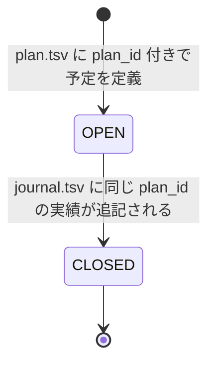

# plan_id ライフサイクル契約 (BQN editor / BQN report 共通契約)

`plan_id` は、将来発生する予定（`plan.tsv`）と、実際に発生した取引実績（`journal.tsv`）を紐づけ、予定の履行状態（完了・未完了）を管理するためのセマンティック・メタデータです。

このドキュメントでは、BQN editor レイヤー（入力・追記）と BQN report レイヤー（計算・レポート）の双方が従うべき `plan_id` のライフサイクルおよび仕様を定義します。旧 Go editor 前提の記述は historical として扱い、現行 daily write path は `tools/edit` / `tools/edit-bqn` です。

---

## 1. ライフサイクル・ステートマシン

予定は `plan_id` を通じて以下の状態遷移をたどります。

### ① OPEN（未履行・予定）
- **条件**: `plan.tsv` に `plan_id=plan-YYYY-MM-DD-series` メタデータを持つ行が存在し、かつ `journal.tsv` に同じ `plan_id` を持つ行が存在しない状態。
- **挙動**:
  - **BQN editor**: `tools/edit plan list` に未完了の予定として表示される。
  - **BQN**: 将来の資金需要予測（残存予定残高・キャッシュアウト予約）に参入される。

### ② CLOSED（履行済み・実績化完了）
- **条件**: `journal.tsv` に対象の `plan_id` を持つ行が1つ以上記録された状態。
- **挙動**:
  - **BQN editor**: `tools/edit plan list` で非表示（`--all` 指定時のみ `[CLOSED]` 表示）となり、`tools/edit plan finish` での重ねての実績化が拒否される。
  - **BQN**: 予定レイヤからは除外され、実績残高として計算される。これによって二重計上を防ぐ。

---

## 2. BQN editor レイヤーの責務（入力・ライフサイクル操作）

BQN editor（`tools/edit`）は、**「予定の実績化（状態遷移の引き金）」**と**「多重履行の防止」**を担当します。

1. **予定一覧のフィルタリング (`plan list`)**
   - デフォルトでは、`journal.tsv` にまだ存在しない `plan_id` の行のみを「OPEN」として表示する。
   - `plan_id` が存在しない行（`[MISSING-ID]`）や不正なID行（`[INVALID-ID]`）は、未完了として表示するが、実績化操作の対象外とする。

2. **実績化アペンド時の情報引き継ぎ (`plan finish`)**
   - 指定された予定行から、`config/meta_schema.tsv` で `scope=plan` と定義されたメタデータ（`recur`, `anchor`, `offset` など）を除去し、`plan_id` を含む他のメタデータを維持したまま `journal.tsv` の末尾に追記する。
   - アペンド時の日付は、オプションで指定された実際の日付（`--actual-date`）で上書きされるが、`plan_id` 自体に含まれる日付（予定日）は**書き換えない**（紐づけ維持のため）。

3. **不変条件（多重履行防止）**
   - 実績化を実行する前に `journal.tsv` をスキャンし、すでにその `plan_id` が存在する場合は `already closed` エラーとしてアペンドを拒否する。

---

## 3. BQN レイヤーの責務（計算・レポート射影）

BQN エンジン（主に `src_next/planned_payments.bqn` と `src_next/plan_journal_overlap.bqn`）は、**「残存予定の算出」**と**「重複・曖昧一致の診断」**を担当します。

1. **残存予定（planned/open items）の計算**
   - レポート生成時点で `plan.tsv` に定義されている予定から、`journal.tsv` ですでに完了（`plan_id` が一致）しているものを除外して「これから発生する予定リスト」を作る。
   - `plan_id` を持たない予定行は互換用 fallback として扱い、5列一致・日付境界による判定に留める。fallback は正本運用ではなく、診断対象の互換経路である。

2. **重複・曖昧一致のハンドリング (Safety Profile / Fail Closed)**
   - `plan.tsv` と `journal.tsv` の強一致・曖昧一致・未一致は `src_next/plan_journal_overlap.bqn` と check で観察する。
   - 異常状態を検知した場合、BQNは「きれいな間違い」をサイレントに出力せず、警告・診断・fail-closed の対象として扱う。

---

## 4. 境界不変条件 (Invariants)

- **BQN editor は会計意味を広げない**: BQN editor は `plan_id` が一致したかどうかと安全な追記可否のみを扱い、それが「何の費用であるか」「今月の残高にどう影響するか」は report engine 側に委ねる。
- **BQN が意味の正本**: `plan_id` の完了判定ロジックや、IDなし行の日付ベースの完了フォールバックは BQN の計算コアが正本として定義する。
- **データ不変**: `plan_id` ライフサイクル操作において、`plan.tsv` 自体は一切書き換え・削除されない（データ追記のみの安全設計）。
