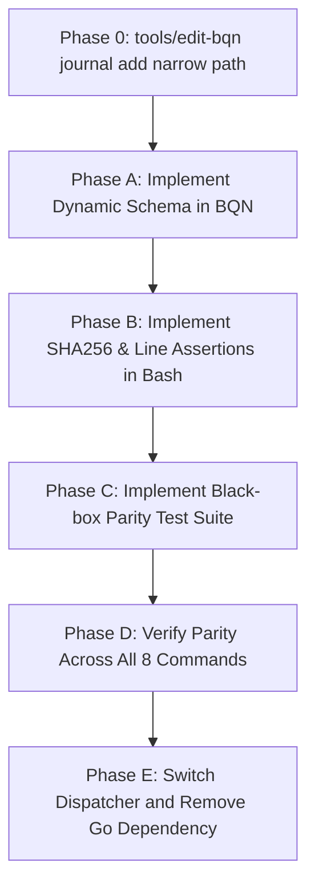

# Go/BQN Editor Gap Alignment Plan

Status: **Superseded historical draft**
Date: 2026-06-29
Superseded: 2026-07-01 by the production BQN editor path and narrow `src_edit/*_cmd.bqn` commands.

This document records the old gap-closing plan from the Go-to-BQN editor transition. The active daily path is now `tools/edit` → `tools/edit-bqn` → narrow BQN commands + shell safe-write. The former aggregate `src_edit/editor_cmd.bqn` dispatcher has been removed.

---

## 1. Background

During Phase 2 of the Go editor removal process, the BQN + Bash editor implementation was successfully bootstrapped. However, to prioritize data safety and workflow parity, we reverted the active wrapper (`tools/edit`) to use the Go editor. 

We will now close the remaining safety and functional gaps systematically before switching the dispatcher permanently.

---

## 2. Identified Gaps

### 0. Dispatcher Contract and Output Protocol
* **Go Editor**: `tools/edit` accepts the current Go-style flag interface directly, for example `tools/edit journal add --date ... --memo ... --from ... --to ... --amount ...`.
* **BQN Editor Prototype**: the former aggregate BQN dispatcher was expected to receive normalized edit intent, not preserve every detail of the Go CLI parser.
* **Gap**: A thin Bash dispatcher must translate the Go-compatible CLI shape into a stable BQN input packet and must parse a stable BQN output protocol before any source TSV write.
* **Safety Rule**: Do not replace production `tools/edit` while this gap is open. Use `tools/edit-bqn` as the experimental entry point.

### A. Dynamic Schema Parsing (`config/meta_schema.tsv`)
* **Go Editor**: Reads `config/meta_schema.tsv` dynamically at runtime. Keys with target `plan` are registered as plan-only metadata and automatically stripped from the metadata when finishing a plan (e.g. converting a plan row into a journal row).
* **BQN Editor**: Hardcodes these plan-only keys (`anchor`, `months`, `offset`, `recur`). If a user customizes `meta_schema.tsv`, the BQN editor fails to respect the new definitions.

### B. Concurrent Write Protection (Stale Checks)
* **Go Editor**: Reads the file size, modification timestamp, and computes a SHA256 hash of the target TSV file at start. Right before performing the atomic write, it re-verifies these parameters against the current file on disk (`checkStale`). If the file was changed by another process, it aborts the write to prevent data loss.
* **BQN Editor + Bash Wrapper**: Lacks strict SHA256 stale checking before writing.

### C. Exact Row Replacement Safety
* **Go Editor**: In `plan edit` and `plan finish`, it ensures that the line content at the target line number matches the expected `oldLine` exactly. If it has drifted, the rewrite is aborted.
* **BQN Editor + Bash Wrapper**: Lacks exact line matching assertion right before writing.

### D. TTY Check and Built-in Interactive Prompts
* **Go Editor**: Detects if stdin is a TTY. If running interactively, it prompts the user inside the editor process (e.g., prompting for actual date in `plan finish`).
* **BQN Editor**: Lacks interactive terminal prompt capability (relies entirely on wrapper/caller scripts).

---

## 3. Plan to Close Gaps (Action Items)

### Step 0: Narrow `journal add` Entry Path
Before closing all parity gaps, prove one safe append path end to end:
1. Keep production `tools/edit` on the Go editor.
2. Add or use an experimental `tools/edit-bqn` wrapper only for BQN editor work.
3. Parse the existing Go-compatible `journal add` flags in Bash.
4. Pass normalized edit intent to BQN.
5. Have BQN return a stable line-oriented protocol, not `OK` and TSV payload mixed in a single ambiguous field.
6. Apply the resulting append through `tools/lib/safe-write.sh` with the same minimum write-safety guarantees as the Go append path: backup, temp-file + atomic rename, and stale detection before rename.
7. Verify the resulting `journal.tsv` bytes against the Go editor for at least one fixture case.

Required BQN output shape for append operations:

```text
OK	APPEND	journal.tsv
<complete TSV row>
```

Protocol rules:

- Line 1 is protocol metadata only: `status`, `operation`, and repo-relative target file.
- Line 2 is the complete TSV row payload. It may contain tabs, so the shell dispatcher must not parse it as protocol fields.
- Validation errors are written as a single `ERROR	<message>` line and must exit non-zero.
- Diagnostics that are not part of the protocol go to stderr, not stdout.

Errors:

```text
ERROR	<message>
```

### Step 1: BQN-Side Dynamic Schema Parsing
Extend the BQN editor modules to parse `config/meta_schema.tsv` dynamically:
1. Import `config.bqn` or use `loader.bqn` to read `config/meta_schema.tsv`.
2. Extract all keys where the 4th column is `"plan"`.
3. Use this dynamic list of keys instead of the hardcoded `planOnlyKeys` inside `RunFinish`.

### Step 2: Bash-Side Safety Features in `tools/edit`
Enhance `tools/edit` and `tools/lib/safe-write.sh` to implement strict stale and drift checking:
1. **SHA256 Stale Check**:
   - When launching `tools/edit`, calculate and store the target file's size, modification time (using `stat` or `date`), and SHA256 hash (using `shasum -a 256` or `openssl dgst -sha256`).
   - Before writing the temporary file back in `safe-write.sh`, re-calculate these parameters and verify they match the initial state. Abort if a mismatch is detected.
2. **Exact Line Matching**:
   - Before replacing a line in `safe-write.sh` (e.g. for `plan edit` or `plan finish`), check that the line at the target line number matches `oldLine` exactly. Abort if it differs.

### Step 3: Parity Test Suite (`checks/check-editor-parity.sh`)
Build an automated, black-box parity testing tool to assert identical behavior:
1. Runs the Go editor (`tools/edit.bin`) and the BQN editor dispatcher on identical copies of fixture directories.
2. Exercises all 8 CLI commands:
   - `journal add` / `journal reverse`
   - `budget add`
   - `issue add`
   - `plan list` (text and tsv formats)
   - `plan add` / `plan edit` / `plan finish`
3. Verifies that:
   - Exit codes match exactly.
   - Stdout and Stderr outputs match character-for-character.
   - Resulting TSV file modifications are byte-for-byte identical.

---

## 4. Migration & Verification Phases



1. **Phase 0**: Add `tools/edit-bqn journal add` as a narrow experimental path. Keep `tools/edit` on Go.
2. **Phase A**: Update the BQN editor command path to dynamically read plan-only keys.
3. **Phase B**: Add robust TTY detection, exact line matching, and SHA256 stale checking in the BQN dispatcher path and `safe-write.sh`.
4. **Phase C**: Write `checks/check-editor-parity.sh` and hook it into `tools/check.sh`.
5. **Phase D**: Run parity testing until all test cases produce identical outputs.
6. **Phase E**: Change the `tools/edit` symlink/dispatch to point to the BQN path, verify, and archive the `editor/` Go codebase.
